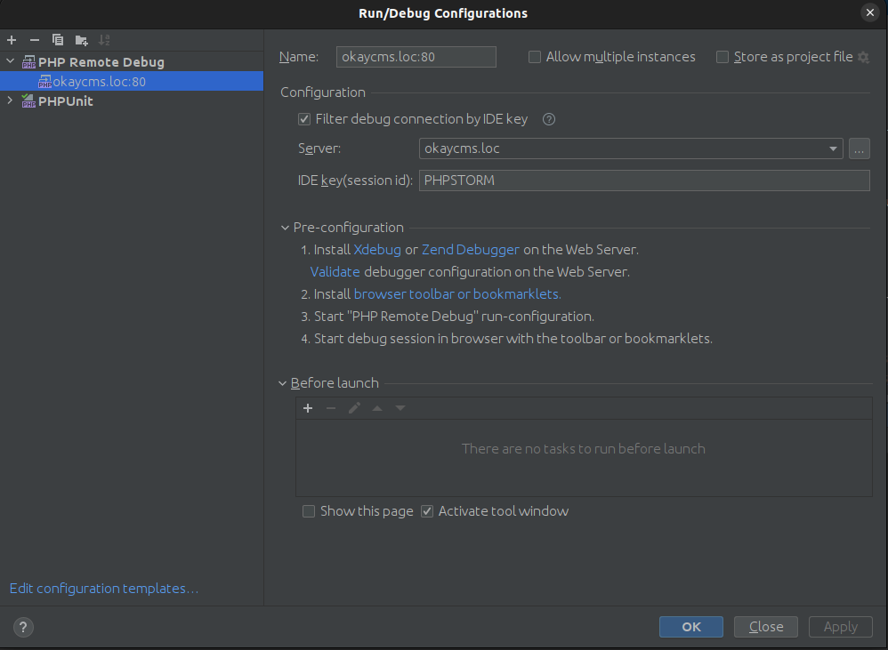

# Docker compose for OkayCMS
## Типова конфігурація

Типова конфігурація містить Nginx в якості web сервера та інтерпретатор php-fpm.
Для запуска оточення треба в директорії dev виконати команду:
```shell
docker compose up -d
```
Якщо на машині планується запускати одночасно кілька проектів на базі одного docker-compose.yml, 
рекомендую вказувати ім'я проекту:
```shell
docker compose -p okay_develop up -d
```
де okay_develop - ім'я проекту.

Також рекомендую, якщо на машині планується кілька проектів, щоб не ходити по http://localhost:80, http://localhost:81...
Додавати всі хости в файл hosts на 127.0.0.1 і запустити обратний проксі.
Ось є непоганий проксі в докер-контейнері. Для запуска в будь-якій директорії виконайте команду:
```shell
docker run -d -p 80:80 -v /var/run/docker.sock:/tmp/docker.sock:ro --net okay_network nginxproxy/nginx-proxy
```
Після запуска можна буде заходити по http на хост, вказаний в .env VIRTUAL_HOST на 80 порт (не залежно який порт
вказаний в HTTP_PORT)

## База даних
При створенні контейнера, в нього заливається дефолтний дамп бази (1DB_changes/okay_clean.sql).
Також при кожному підніманні контейнера створюється або оновлюється менеджер адмін-панелі (admin).
Стандартні дані для входу в адмін-панель ***admin / 1234***

## Ресайз зображень
Коли на локальний сервер береться БД з production сайта, завжди є проблема з оригіналами зображень товарів, категорій тощо.
Тому можна вказати в .env файлі змінну PRODUCTION_DOMAIN, де буде вказаний домен, з якого бралась база,
і нарізки зображень братимуться з того домена по http. Важливо, це працюватиме лише для зображень, розмір ресайзу
яких співпадає з production сервером.
На локальний сервер в директорію originals зображення не додаються, вони збережуться лише в resized директорію.

## Тестування Email
Щоб тестувати Email на локальному сервері і не відправляти реальні листи людям, вкажіть вашу тестову пошту в 
.env TEST_INTERNAL_EMAIL, таким чином всі листи будуть перенаправлені на цю пошту.

## Налаштування Xdebug
Щоб налаштувати Xdebug для роботи з PHPStorm треба зробити наступне:

1. Ідемо в Settings > PHP > Servers і додаємо сервер.
Host та port указуємо як в файлі .env (VIRTUAL_HOST, HTTP_PORT)
2. Також тут налаштовуємо Path mapping (корень сайта на хостовій машині указуємо як /var/www/html на сервері)
3. В Settings > PHP > Debug > XDebug додаємо порт 9001
4. Ідемо в Run > Edit configurations та створюємо конфігурацію на основі `PHP Remote Debug`
В полі Server указуємо сервер створений вище, в IDE key вписуємо PHPSTORM.
Назву рекомендую вказувати як host:port 

Приклади конфігурації



