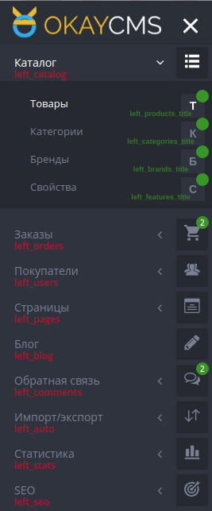
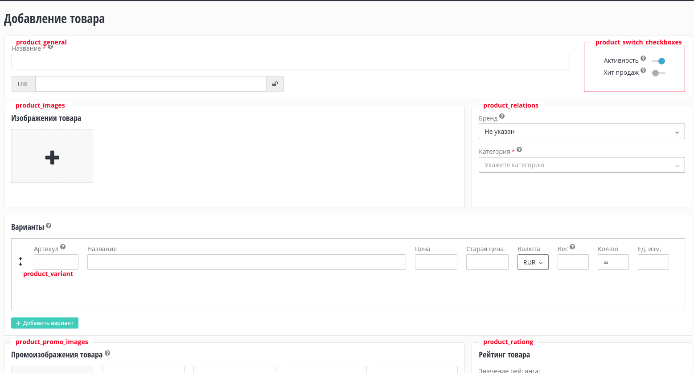

# Режим розробника

Режим розробника потрібен для зручнішої розробки. Він додає на сайт допоміжну інформацію.
Щоб активувати режим розробника, у конфігу (`config/config.php`) потрібно встановити директиву `dev_mode = true`.

#### Меню адмін-панелі

Щоб додати пункт меню в адмін-панелі, потрібно скористатися методом
[extendBackendMenu()](./modules/init.md#extendBackendMenu), 
Щоб переглянути наявні групи меню, увімкніть режим розробника — і в admin-частині до груп меню буде
додано (червоним кольором) назву групи.

Також у меню можна додавати лічильники нових подій. Для цього потрібно використати зелену назву лічильника для
пункту меню та скористатися методом [ManagerMenu::addCounter()](./core/ManagerMenu.md#addCounter)

#### Шорт-блоки

Шорт-блоки в OkayCMS потрібні для того, щоб модулі могли вставляти туди свій HTML-код. Адмін-панель розмічена шорт-блоками,
назва яких завжди унікальна. Модулі, що додають свою верстку в блок, завжди додають її в кінець блока.
Якщо кілька модулів додаються в один і той самий блок, вони додаються послідовно — у тому порядку, як вони розташовані
в розділі модулів.

Також кілька блоків (але їх дуже обмежена кількість) є в клієнтській частині сайту.

Щоб переглянути доступні шорт-блоки, потрібно увімкнути режим розробника та перейти в адмін-панель сайту.
Буде видно червоні написи; під час наведення на них підсвічуватиметься межа блока.

Щоб додати шорт-блок, потрібно скористатися методом [Init::addBackendBlock()](./modules/init.md#addBackendBlock) або
[Init::addFrontBlock()](./modules/init.md#addFrontBlock).
